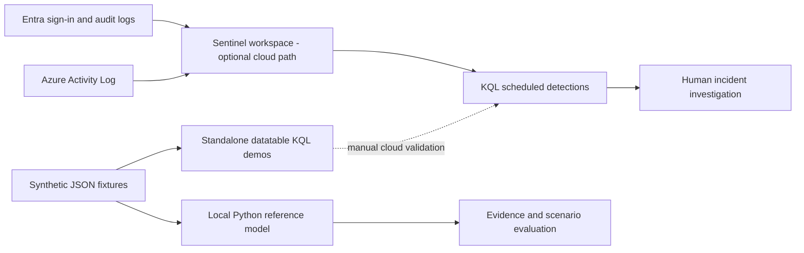

# Azure Sentinel Threat Detection

A personal detection-engineering lab for spotting suspicious authentication, identity
privilege changes, and unexpected deletion of Azure diagnostic settings. It combines
three KQL detections with synthetic evidence, a Python reference model, false-positive
analysis, and a simulated investigation. Built as practical preparation for SOC work
and SC-200; no production telemetry or production performance claims.

**Validation:** 11 Python tests passed locally. The reference model processed 29
synthetic events. KQL execution, data connectors, scheduled analytics, and live
incident creation remain **unverified in Azure**. Python tests do not validate KQL syntax.

## Architecture



## Start and reproduce

Use Python 3.11 or later. There are no third-party Python dependencies or credentials.
Run commands from this repository root (`python` can be `py -3` on Windows).

```sh
python -m unittest discover -s tests -v
python -m lab
python scripts/make_kql_demo.py
```

Read the genuine [simulation output](evidence/simulation.json) and
[test transcript](evidence/local-validation.txt). Generation of `demo/*.kql` does not
execute KQL. The demos use inline tables and a fixed January 15, 2026 analysis time;
the production-shaped queries in `detections/` use the current clock.

## Detections and decisions

| Rule | Signal | ATT&CK hypothesis | Main tradeoff |
| --- | --- | --- | --- |
| AUTH-001 | At least 10 password/lockout failures across 5 users per source IP per 5-minute bin | T1110.003 Password Spraying | Shared NAT and stale credentials can look identical |
| IAM-001 | Successful Entra active or eligible role membership addition | T1098.003 Additional Cloud Roles | Approved PIM work also alerts |
| AZ-001 | Successful diagnostic-settings deletion by an actor outside the lab baseline | T1562.008 Disable or Modify Cloud Logs | Absence from an allowlist is not proof of unauthorized activity |

`detections/catalog.json` records severity, schedule, and mappings. Mappings describe
possible adversary behavior; they do not prove intent. AUTH-001 recognizes only
50126 and 50053 codes and cannot establish that one password was tried across users.
IAM-001 preserves application initiators and raw target data to avoid silently losing
service-principal changes. AZ-001 preserves the affected resource and correlation ID.
The example approval list must be replaced with reviewed local change context.

## Results and limitations

The eight labeled scenarios yield **3 true positives, 2 false positives, 3 true
negatives, and 0 false negatives** in the Python simulation. These are scenario counts,
not event counts or production accuracy. The fixture intentionally includes shared-NAT
failures and approved PIM eligibility changes. A separate boundary test demonstrates
a missed spray split across fixed bins; it is not included in the eight-scenario matrix.

No tenant ingestion delays, real-world event variants, cross-tenant identities,
distributed/slow spraying, or query-engine behavior have been tested. Overlapping
15-minute lookbacks can repeat findings every 5 minutes. See
[validation and tuning](docs/validation.md) before enabling cloud analytics.

## Code and documentation map

- `detections/`: KQL logic and rule metadata; `demo/`: self-contained synthetic KQL.
- `data/`: source events and scenario labels; `lab/engine.py`: transparent local model.
- `tests/`: thresholds, case handling, initiators, time bounds, and documented blind spot.
- [Cloud setup](docs/cloud-setup.md): prerequisites, connectors, rule settings, and cleanup.
- [Incident report](docs/incident.md): evidence-linked simulated investigation.
- [Demo and interview guide](docs/walkthrough.md): repeatable explanation and questions.
- [Official references](docs/references.md): sources checked during implementation.

## Cleanup and resume wording

Local execution creates only `evidence/simulation.json` and `demo/*.kql`; remove or
regenerate these files as needed. Cloud cleanup is separate and described in the setup
guide. This repository creates no cloud resources automatically.

**Resume bullet:** Built a personal Microsoft Sentinel detection lab with three KQL
rules, synthetic identity and Azure activity logs, a locally tested Python validation
model, MITRE ATT&CK mappings, and a documented simulated incident investigation.

MIT licensed. All identities, addresses, and incident facts in fixtures are synthetic.
